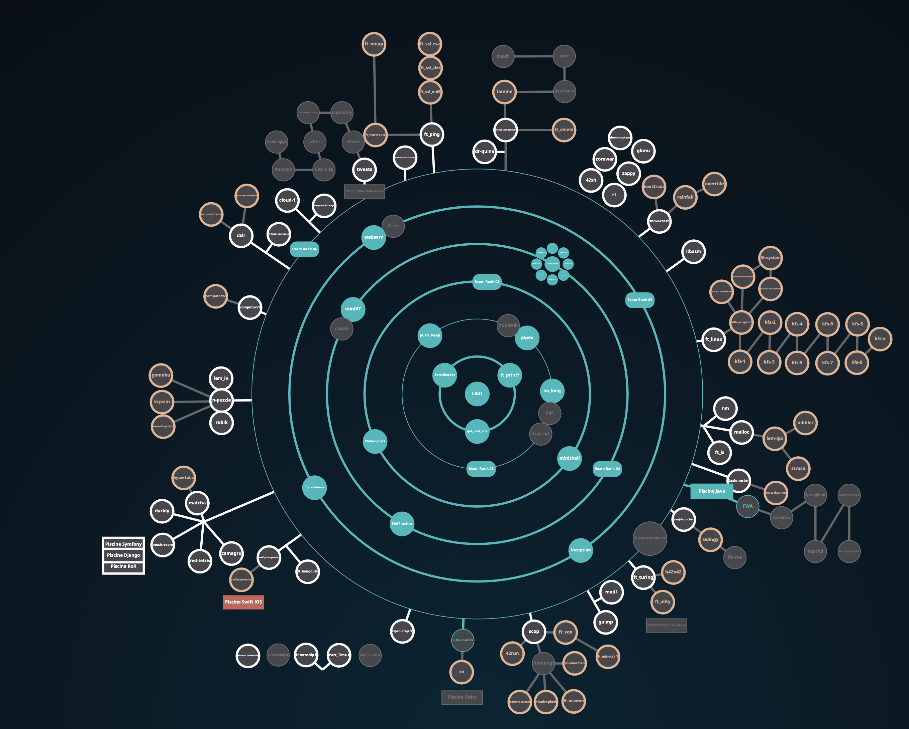

# 🖥️ Проекты School 21 / Ecole 42
1. [philosophers](https://github.com/CreativeWex/School21-Ecole42-Projects/tree/main/philosophers) - синхронизация потоков и процессов. Дейкстрова задача об обедающих  философах.

2. [push_swap](https://github.com/CreativeWex/School21-Ecole42-Projects/tree/main/push_swap) - алгоритм сортировки стеков целочисленных значений с применением двусвязных списков.

3. [pipex](https://github.com/CreativeWex/School21-Ecole42-Projects/tree/main/pipex) - программная реализация труб(pipe) из UNIX-подобных ОС.

4. [born_2_be_root](https://github.com/CreativeWex/School21-Ecole42-Projects/tree/main/born_2_be_root) - Настройка SSH и UFW firewall для удаленного подключения пользователей. Создание и настройка политики паролей. С помощью демона Cron и языка Bash написан скрипт, отправляющий системные характеристики пользователям с заданным промежутком времени.

5. [libft](https://github.com/CreativeWex/School21-Ecole42-Projects/tree/main/learning%20c/libft) - реализация библеотеки стандартных функций языка С.

6. [ft_printf](https://github.com/CreativeWex/School21-Ecole42-Projects/tree/main/learning%20c/ft_printf) - реализация функции printf языка С, работа с функциями с неопределенным количеством аргументов.

7. [get_next_line](https://github.com/CreativeWex/School21-Ecole42-Projects/tree/main/learning%20c/get_next_line) - реализация функции getline языка С.

