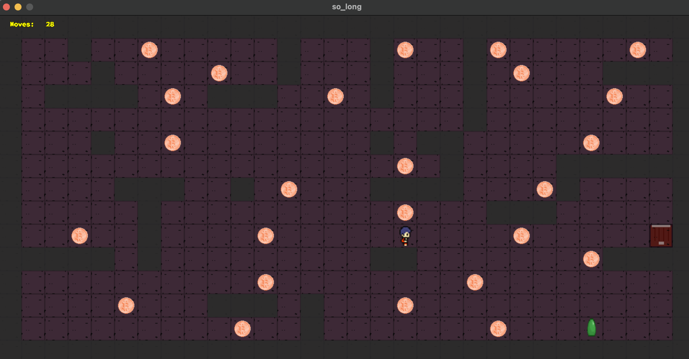

# so_long

Игра, цель которой собрать все монетки, минуя противников и сбежать через открывшийся выход.

## Header

t_game - структура, хранит игровые данные, одинаковые переменные с разными индексами нужны для анимации спрайтов


## Main

``ft_check_extension(файл карты.ber)`` - проверка вводимого имени файла, отвечающего за карту.
Функция проверяет последние 4 символа имени файла на соответствие ".ber" и длину имени файла

``ft_init_struct(&game)`` - инициализирует структуру

``game.map = ft_parsing(argv[1]);`` - обрабатываем данные из файла карты

### III) Считываем карту с файла, получаем данные для дальнейшей обработки

 ```ft_analyse_map.c !```

Переменной number_of_lines присваиваем количество строк в карте, вычисляемое в ft_map_count_lines
(reading_condition - результат итерационного срабатывания read() - считанные байты / -1 в случае ошибки)


Выделяем файл с картой, выделяем память под массив строк размер которого равен количеству строк

### IV) Проверка считанной карты, сбор информации о карте!!!!

``ft_is_map_correct(t_game game)`` проверяет, является ли карта прямоугольной: вычисляет длину первой строки и принимает ее как базовую. Сравнивает длины всех строк с базовой и в случае расхождения вызывает ошибку.

``void ft_calculate_game_data(t_game *game)`` проходится по всем клеткам на карте, определяет положение игрока (координаты), количество collectables, количество выходов.

Проверяет количество всех объектов на удовлетворение условиям

```ft_check_walls()``` проверяет, правильно ли расставлены стены !!!!!!!!!!!!!!!!!!!!!!!!!!

### V) Враги

```ft_enemy_init(t_game *game)``` - если размеры комнаты позволяют, размещает врага

### VI) Запуск игры

```void ft_start(t_game game)```
```game->mlx = mlx_init();``` инициализация указателя для работы с библеотекой



